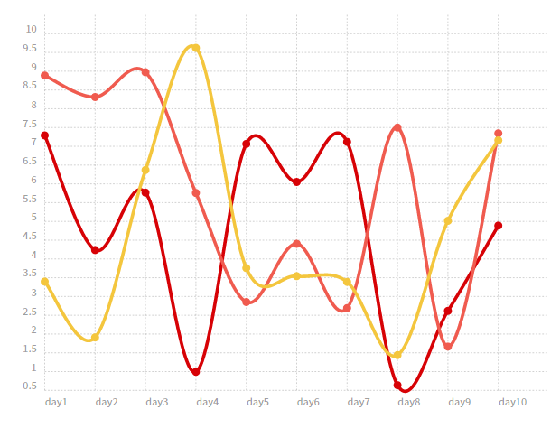

Chartist.js for R, powered by htmlwidgets
================

`chartist` is an R package to draw charts by [Chartist.js](http://gionkunz.github.io/chartist-js/index.html)
via [htmlwidgets](https://github.com/ramnathv/htmlwidgets) interface.

# Installation

```r
devtools::install_github("yutannihilation/chartist")
```

# Example

```r
set.seed(324)
data <- data.frame(
  day = paste0("day", 1:10),
  A   = runif(10, 0, 10),
  B   = runif(10, 0, 10),
  C   = runif(10, 0, 10)
)

# NSE version
chartist(data, day)
```


